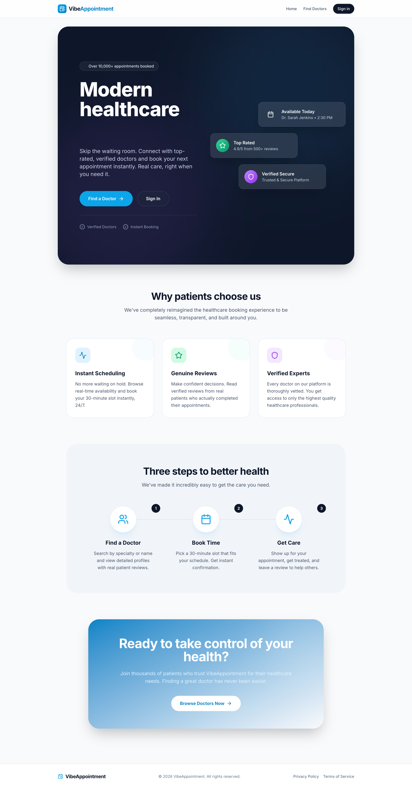

# Product Guide

## VibeAppointment

> **Modern healthcare simplified.**

**Production URL:** [https://vibe-appointment.vercel.app](https://vibe-appointment.vercel.app/)

VibeAppointment is a healthcare appointment booking platform that connects patients with verified doctors. Skip the waiting room — browse real-time availability, book 30-minute slots instantly, and leave reviews after your visit.



---

## Overview

The platform serves three types of users:

| Role        | Description                                                                     |
| ----------- | ------------------------------------------------------------------------------- |
| **Patient** | Browse doctors, book appointments, cancel bookings, leave reviews after visits. |
| **Doctor**  | Manage profile, set weekly availability, handle time-off, confirm/decline appointments, view schedule. |
| **Admin**   | Review and approve or reject doctor registration applications.                  |

---

## User Journeys

### Patient Journey

```
Sign In ──► Browse Doctors ──► View Profile ──► Pick a Slot ──► Confirm Booking
                                                                        │
                                               Patient Dashboard ◄──────┘
                                              ┌──────┼──────────┐
                                       Cancel Appt   │   View Declined
                                                     │   Notifications
                                              After the visit
                                                     │
                                               Leave a Review
```

1. **Sign in** via email OTP or Google OAuth at `/login`.
2. **Browse doctors** at `/doctors` — filter by specialty or search by name.
3. **View a doctor's profile** at `/doctors/<id>` — see bio, qualifications, ratings, and patient reviews.
4. **Book an appointment** at `/appointments/new/<doctorId>` — select a date, pick an available 30-minute slot, and confirm.
5. **Manage appointments** from the patient dashboard at `/dashboard`:
   - View upcoming and past appointments.
   - **Cancel** a scheduled or confirmed appointment (with confirmation prompt). The cancelled slot is immediately freed for other patients.
   - See **declined appointment notifications** when a doctor declines a request, with options to rebook or dismiss.
6. **Leave a review** at `/reviews/<doctorId>/new` after a completed appointment — rate the doctor on effectiveness, behavior, and overall experience.

### Doctor Journey

```
Register ──► Wait for Approval ──► Set Up Profile ──► Add Availability ──► Manage Schedule
                                                                                  │
                                                                     ┌────────────┼────────────┐
                                                                  Confirm      Decline      Complete
                                                                  Appts        Appts        / No-Show
```

1. **Register** at `/register` — submit name, degree, specialty, clinic details, and a short bio.
2. **Await admin approval** — the application starts in "pending" status.
3. **Set up profile** at `/settings/profile` — update photo, bio, and qualifications.
4. **Configure availability** at `/settings/availability` — define recurring weekly time slots (e.g., Monday 9:00 AM–12:00 PM).
5. **Manage time-off** at `/settings/time-off` — block specific date ranges for vacations or personal leave.
6. **Manage schedule** on the doctor dashboard at `/doctor-dashboard`:
   - View today's appointments and upcoming appointments (next 7 days).
   - **Confirm** or **decline** scheduled appointments.
   - Mark confirmed appointments as **completed**, **no-show**, or **cancelled**.
   - View recent patient reviews and overall ratings.

### Admin Journey

```
Sign In ──► Review Pending Doctors ──► Approve or Reject
```

1. **Sign in** with an account that has `is_admin = true` in the database.
2. **Review applications** at `/admin/dashboard` — see all pending doctor registrations.
3. **Approve or reject** each application. Approved doctors become visible to patients on the platform.

---

## Features

### Public Pages

| Page               | Route             | Description                                                    |
| ------------------ | ----------------- | -------------------------------------------------------------- |
| Landing page       | `/`               | Hero section, feature highlights, and call-to-action.          |
| Doctor directory   | `/doctors`        | Searchable, filterable list of all approved doctors.           |
| Doctor profile     | `/doctors/<id>`   | Full profile with bio, ratings, reviews, and a booking link.   |

### Authentication

| Method        | Description                                                                                   |
| ------------- | --------------------------------------------------------------------------------------------- |
| Email OTP     | Users enter their email, receive a one-time code, and verify it to sign in.                   |
| Google OAuth  | Users authenticate with their Google account. A profile is auto-created on first sign-in.     |

Both methods create a `user_profiles` record with a default role of "patient". Signing out clears the session cookie.

### Appointment Booking

- Appointments are fixed **30-minute** slots.
- Slot availability is computed from the doctor's weekly schedule, minus existing bookings and time-off blocks.
- Patients select a date and pick from the available slots displayed.
- Each slot is unique per doctor — no double-booking is possible (enforced by a partial unique index at the database level).
- When an appointment is **cancelled** or **declined**, the slot is automatically freed and becomes available for other patients to book.

**Appointment statuses:**

| Status       | Meaning                                                                                       |
| ------------ | --------------------------------------------------------------------------------------------- |
| `scheduled`  | Newly booked, awaiting doctor confirmation.                                                   |
| `confirmed`  | Doctor has confirmed the appointment.                                                         |
| `completed`  | The visit took place.                                                                         |
| `cancelled`  | Cancelled by the patient or doctor. The slot is freed for rebooking.                          |
| `declined`   | Doctor declined the appointment request. Patient is notified and can rebook.                  |
| `no_show`    | Patient did not attend.                                                                       |

**Status transitions:**

| Actor    | From         | To                                  |
| -------- | ------------ | ----------------------------------- |
| Patient  | `scheduled`  | `cancelled`                         |
| Patient  | `confirmed`  | `cancelled`                         |
| Doctor   | `scheduled`  | `confirmed`, `declined`             |
| Doctor   | `confirmed`  | `completed`, `cancelled`, `no_show` |

### Reviews & Ratings

- Only patients with a **completed** appointment can leave a review.
- Each appointment can have **one** review (enforced by a unique index).
- Reviews include three separate ratings (1–5 scale):
  - **Effectiveness** — how well the treatment worked.
  - **Behavior** — bedside manner and communication.
  - **Overall** — general satisfaction.
- A free-text comment is optional.
- Aggregate ratings are stored on the doctor record for efficient display.

### Doctor Settings

| Setting        | Route                    | Purpose                                               |
| -------------- | ------------------------ | ----------------------------------------------------- |
| Profile        | `/settings/profile`      | Edit name, degree, specialty, bio, and photo.         |
| Availability   | `/settings/availability` | Define recurring weekly time windows.                 |
| Time-off       | `/settings/time-off`     | Block specific date ranges (vacation, leave, etc.).   |

### Patient Dashboard

Located at `/dashboard`. The patient dashboard provides:

- **Upcoming appointments** — list of scheduled and confirmed appointments with doctor name, date/time, clinic, and status. Each appointment has a **Cancel** button with a confirmation prompt.
- **Declined appointment notifications** — a banner for appointments that have been declined by the doctor. Patients can **rebook** with the same doctor or **dismiss** the notification.
- **Recent visits & reviews** — completed appointments with a link to leave a review if not yet submitted.

### Doctor Dashboard

Located at `/doctor-dashboard`. The doctor dashboard provides:

- **Today's schedule** — all appointments for today with patient names and inline action buttons (confirm, decline, complete, no-show).
- **Upcoming appointments** — next 7 days of scheduled and confirmed appointments with action controls.
- **Recent reviews** — latest patient reviews with ratings and comments.
- **Quick actions** — links to manage availability, time-off, and profile settings.
- **Alerts** — notifications for pending approval status or missing availability configuration.
- **Stats** — today's appointment count, upcoming count, and overall rating.

### Admin Panel

- Located at `/admin/dashboard`.
- Displays all doctor registrations grouped by status.
- Admins can approve or reject pending applications with a single action.

---

## Route Protection

The application uses Next.js middleware and server-side auth guards to protect routes:

| Route Pattern                  | Access Level         |
| ------------------------------ | -------------------- |
| `/`, `/doctors`, `/doctors/*`  | Public (no login)    |
| `/login`, `/register`         | Public               |
| `/dashboard`, `/appointments/*`, `/reviews/*` | Patient only |
| `/doctor-dashboard`, `/settings/*`            | Doctor only  |
| `/admin/*`                     | Admin only           |
| `/api/auth/*`                  | Public               |
| All other `/api/*`             | Authenticated        |

Unauthenticated users attempting to access a protected route are redirected to `/login` with a `redirectTo` parameter so they return to the intended page after signing in.

---

## API Reference

### Authentication

| Method | Endpoint             | Body                         | Description                 |
| ------ | -------------------- | ---------------------------- | --------------------------- |
| POST   | `/api/auth/otp`      | `{ email }` or `{ email, otp }` | Send or verify an email OTP |
| POST   | `/api/auth/login`    | —                            | Initiate Google OAuth flow  |
| GET    | `/auth/callback`     | —                            | OAuth callback handler      |

### Appointments

| Method | Endpoint                          | Body / Query                                      | Description                                           |
| ------ | --------------------------------- | ------------------------------------------------- | ----------------------------------------------------- |
| POST   | `/api/appointments`               | `{ doctorId, clinicId, startAt }`                 | Create a new appointment                               |
| PATCH  | `/api/appointments/<id>`          | `{ status }` or `{ patientAck: true }`            | Update status or dismiss a declined notification       |
| GET    | `/api/doctors/slots/<doctorId>`   | `?date=YYYY-MM-DD`                               | Get available slots for a date                         |

**PATCH details:**

- **Patient** can set `status` to `cancelled` (from `scheduled` or `confirmed`), or set `patientAck: true` to dismiss a declined appointment notification.
- **Doctor** can transition: `scheduled` → `confirmed` / `declined`; `confirmed` → `completed` / `cancelled` / `no_show`.

### Doctors

| Method | Endpoint                          | Description                     |
| ------ | --------------------------------- | ------------------------------- |
| POST   | `/api/doctor/register`            | Submit a new doctor application |

### Reviews

| Method | Endpoint                          | Description                     |
| ------ | --------------------------------- | ------------------------------- |
| POST   | `/api/reviews`                    | Submit a review for a completed appointment |

### Admin

| Method | Endpoint                          | Description                     |
| ------ | --------------------------------- | ------------------------------- |
| POST   | `/api/admin/doctor/<id>/approve`  | Approve a pending doctor        |
| POST   | `/api/admin/doctor/<id>/reject`   | Reject a pending doctor         |

---

*For setup instructions, see the [Setup Guide](./SETUP.md).*
*For the database schema, see the [Database Guide](./DATABASE.md).*
